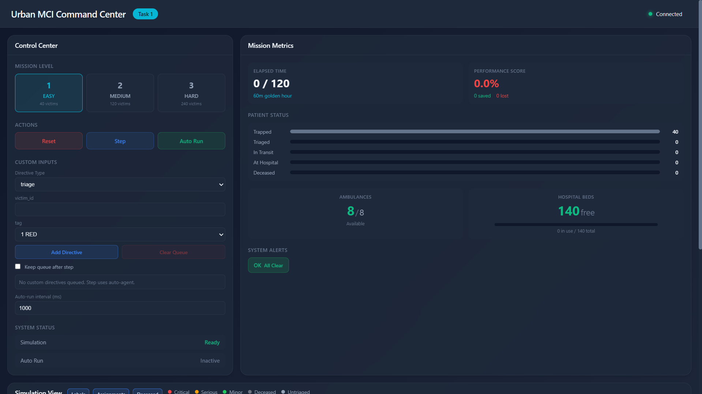
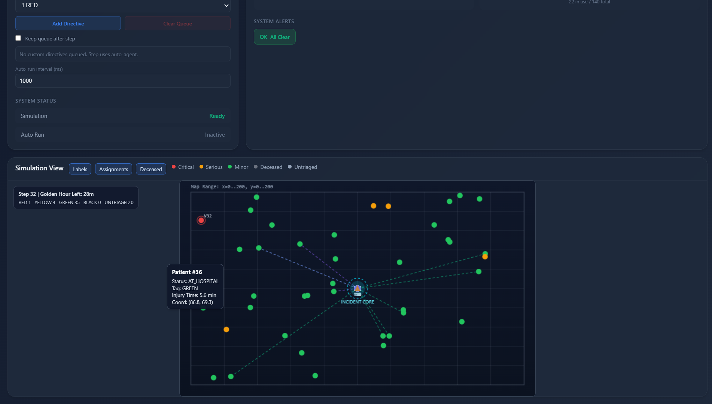

# 🚑 Urban MCI Command Center

<div align="center">


[](https://python.org)
[](LICENSE)
[](https://openenv.dev)
[](https://huggingface.co)
[](.)

**A high-fidelity reinforcement learning environment for AI-assisted disaster response.**  
Train agents to command mass casualty incidents in real time — triage, dispatch, coordinate, survive.

[🚀 Quick Start](#-quick-start) · [🎮 Live Demo](#-dashboard) · [📊 Benchmarks](#-benchmarks) · [📖 Docs](#-observation-space)

</div>

---

## 🌍 Real-World Impact

> *"In mass casualty incidents, most preventable deaths occur within the first 60 minutes — the golden hour."*

Every second of delayed triage or mis-dispatched ambulance means a lower survival rate. This environment simulates real urban disaster scenarios — building collapses, secondary explosions, road blockages — to train AI systems capable of **coordinating emergency response at superhuman speed and accuracy**.

By optimizing triage classification, ambulance dispatch, and hospital routing under time pressure and partial observability, agents trained here could one day assist real incident commanders in saving lives that today are lost to slow decisions.

---

## 🏗️ System Architecture

```
┌─────────────────────────────────────────────────────────────────────┐
│                     URBAN MCI COMMAND ENVIRONMENT                    │
│                                                                      │
│  ┌──────────────┐    Observation     ┌──────────────────────────┐   │
│  │              │ ─────────────────► │                          │   │
│  │  Simulation  │                    │      AI AGENT            │   │
│  │   Engine     │ ◄───────────────── │  (Incident Commander)    │   │
│  │  (1 step =   │    Action          │                          │   │
│  │   60 seconds)│                    │  • Triage victims        │   │
│  │              │                    │  • Dispatch ambulances   │   │
│  └──────┬───────┘                    │  • Assign SAR/Fire teams │   │
│         │                            └──────────────────────────┘   │
│         │ Events                                                     │
│  ┌──────▼──────────────────────────────────────────────────────┐    │
│  │  Dynamic World State                                         │    │
│  │  • 40–240 victims (partial observability — true tags hidden) │    │
│  │  • 4–8 ambulances    • 2–4 hospitals (capacity-aware)        │    │
│  │  • Secondary collapse risk clock  • Road blockages           │    │
│  │  • Media pressure events          • Golden hour countdown    │    │
│  └─────────────────────────────────────────────────────────────┘    │
└─────────────────────────────────────────────────────────────────────┘
```

**One environment step = 60 seconds of simulated time.**  
The golden hour = **60 steps**. After step 60, survival probability decays exponentially.

---

## 🎯 Why This Problem is Hard

| Challenge | Description |
|-----------|-------------|
| 🔀 **Multi-dimensional allocation** | Ambulances, SAR teams, fire teams, hospitals — all with different capabilities and capacities |
| ⏱️ **Time-critical decisions** | RED victims begin dying after 60 minutes; every wasted step costs lives |
| 🫥 **Partial observability** | True triage tags are hidden until properly assessed — the agent must infer |
| ⚡ **Dynamic events** | Secondary collapse, road blockages, and media pressure emerge mid-episode |
| ⚖️ **Competing priorities** | Saving the most critical individual vs. maximizing overall throughput |

---

## 📋 Task Configurations

| Task | Difficulty | Victims | Ambulances | Hospitals | Complicating Events |
|------|------------|---------|------------|-----------|---------------------|
| 1 | 🟢 Easy | 40 | 8 | 2 | None |
| 2 | 🟡 Medium | 120 | 5 | 3 | Secondary collapse at t=30 |
| 3 | 🔴 Hard | 240 | 4 | 4 | Road blockage t=10 · Media t=15 · Collapse t=20 |

---

## 🖥️ Dashboard


*Step 0/120 — All 40 victims trapped, 8/8 ambulances ready, 140 beds free*


*Step 32/120 — 55.3% performance score, 21 saved, 7 in transit*


*Live 200×200 map — color-coded victims, ambulance routes, incident core*

The command center ships with a real-time web dashboard showing live simulation state:

> **Left panel:** Control Center — select mission level, step/auto-run, queue custom directives  
> **Right panel:** Mission Metrics — elapsed time, performance score, patient status pipeline, ambulance & bed availability  
> **Bottom panel:** Simulation View — live 200×200 map with color-coded victims (🔴 Critical · 🟠 Serious · 🟢 Minor · ⚫ Deceased · ⚪ Untriaged), assignment lines, and incident core

```
Step 0/120 — 60m golden hour — 40 trapped — 8/8 ambulances — 140 free beds
→ After 32 steps: 55.3% score — 21 saved — 7 in transit — 22 at hospital
```

---

## 🔧 Quick Start

```bash
# 1. Clone the repository
git clone https://github.com/your-repo/urban-mci-env.git
cd urban-mci-env

# 2. Install dependencies
pip install -r requirements.txt

# 3. Run smoke tests
python urban_mci_env.py

# 4. Launch dashboard (optional)
python app.py
```

---

## 🎮 Usage

### Basic Environment Loop

```python
from urban_mci_env import UrbanMCIEnv, IncidentAction, grade

# Initialize environment (task 1 = easy, 40 victims, 8 ambulances)
env = UrbanMCIEnv(task=1)
state = env.reset()

# Build and execute an action
action = IncidentAction(directives=[
    {"type": "triage",   "victim_id": 0, "tag": 1},           # Tag victim 0 as RED
    {"type": "dispatch", "team_id": 0, "victim_id": 0, "hospital_id": 0},  # Send ambulance 0
])

state, reward, done, info = env.step(action)

# Final normalized score (0.0 – 1.0)
score = grade(env)
print(f"Score: {score:.2f}")
```

### Running the Inference Agent

```bash
export HF_TOKEN=your_token_here
export API_BASE_URL=https://router.huggingface.co/v1
export MODEL_NAME=Qwen/Qwen2.5-72B-Instruct

python inference.py
```

---

## 🔍 Step-by-Step Walkthrough

Here's what a well-played sequence looks like in Task 1:

```
━━━━━━━━━━━━━━━━━━━━━━━━━━━━━━━━━━━━━━━━━━━━━━━━━━━━━━━━━━━━━━━
STEP 1  |  Golden hour: 59 min  |  40 victims trapped
━━━━━━━━━━━━━━━━━━━━━━━━━━━━━━━━━━━━━━━━━━━━━━━━━━━━━━━━━━━━━━━

Observation : Victim 3 — labored breathing, altered mental status
              Victim 7 — minor laceration, walking wounded
              Victim 12 — no pulse detected

Actions     :
  triage(victim=3,  tag=RED)      → correct (+1.0)
  triage(victim=7,  tag=GREEN)    → correct (+0.5)
  triage(victim=12, tag=BLACK)    → correct (+0.5)
  dispatch(team=0, victim=3, hospital=0)  → Level 1 trauma (+0.3 + 0.5 bonus)

Step reward : +2.8
━━━━━━━━━━━━━━━━━━━━━━━━━━━━━━━━━━━━━━━━━━━━━━━━━━━━━━━━━━━━━━━

STEP 5  |  Golden hour: 55 min  |  Victim 3 arrives at hospital

Delivery reward for RED victim (on time): +10.0 × 1.0 (no decay)
Running total reward: +24.6
━━━━━━━━━━━━━━━━━━━━━━━━━━━━━━━━━━━━━━━━━━━━━━━━━━━━━━━━━━━━━━━
```

> **Key insight:** Getting RED victims triaged AND dispatched in the first 5 steps has outsized impact — their delivery bonus is only full-value before step 60.

---

## 📊 Observation Space

| Field | Type | Description |
|-------|------|-------------|
| `step` | int | Current step (1–120) |
| `golden_hour_remaining` | int | Minutes left before decay begins |
| `secondary_collapse_risk` | float | Probability of secondary collapse (0–1) |
| `road_blocked` | bool | Main access route status |
| `victims[]` | list | Per-victim observations (partial — true tags hidden) |
| `hospitals[]` | list | Capacity, tier, available beds |
| `teams[]` | list | Ambulance/SAR/fire availability |

---

## 🎯 Action Space

Every step the agent submits a list of directives:

```python
# 1. Triage a victim (tag: 0=BLACK, 1=RED, 2=YELLOW, 3=GREEN)
{"type": "triage", "victim_id": int, "tag": TriageTag}

# 2. Dispatch ambulance to hospital
{"type": "dispatch", "team_id": int, "victim_id": int, "hospital_id": int}

# 3. Assign SAR team (rescue from rubble)
{"type": "assign_sar", "team_id": int, "victim_id": int}

# 4. Assign fire team (clear hazards / blockages)
{"type": "assign_fire", "team_id": int, "victim_id": int}
```

---

## 🏆 Reward System

### Triage

| Action | Reward |
|--------|--------|
| Correct RED triage | **+1.0** |
| Correct non-RED triage | +0.5 |
| Missed RED (tagged non-RED) | **−2.0** |
| Minor mistag | −0.3 |

### Dispatch

| Action | Reward |
|--------|--------|
| Ambulance dispatched | +0.3 |
| RED → Level 1 trauma center | **+0.5 bonus** |
| RED → lower-tier hospital | −0.3 |
| Dispatch to full hospital | −0.5 |
| Dispatch without prior triage | −0.3 |

### Delivery (when victim reaches hospital)

| Victim Type | Base Reward | Time Decay |
|-------------|-------------|------------|
| 🔴 RED | **+10.0** | After step 60: `exp(-(t-60)/30)` |
| 🟡 YELLOW | +4.0 | After step 120: `exp(-(t-120)/60)` |
| 🟢 GREEN | +1.0 | None |
| ⚫ BLACK | −1.0 | Wasted resources |

### Post–Golden Hour Multiplier

After step 60, **all rewards** are multiplied by:

```
reward × exp(-overtime / 30)
```

This creates an exponential urgency cliff that mirrors real-world survival curves.

---

## 🧠 Strategy Guide

### What a good agent does

**1. Front-load RED triage**  
RED victims have the narrowest survival window. Identify and tag them in the first 5–10 steps before the golden hour is half-spent.

**2. Route RED → Level 1 trauma only**  
Sending a critical victim to a lower-tier facility loses the +0.5 dispatch bonus AND risks lower survival outcomes. Always check hospital tier before dispatching.

**3. Never dispatch to full hospitals**  
Wasting an ambulance run costs −0.5 immediately and delays a victim's treatment. Check `hospital.available_beds > 0` before every dispatch.

**4. Triage before you dispatch**  
Dispatching without triage incurs −0.3. Even a 1-step delay for triage pays off.

**5. Use SAR/fire teams proactively**  
Assigning SAR to trapped victims increases the pool of saveable cases. Assigning fire teams clears blockages before they cut off hospital routes (critical in Task 3 where roads block at t=10).

**6. Respect secondary collapse risk**  
When `secondary_collapse_risk > 0.5`, prioritize extracting victims from unstable zones. A collapse event can invalidate all ongoing rescue missions.

**7. Batch actions per step**  
The environment accepts multiple directives in one step. Batch your triage + dispatch together — don't waste a step doing one thing at a time.

### Step-Priority Matrix

```
Golden hour > 30 min remaining:
  Priority: RED triage + immediate dispatch to Level 1

Golden hour 10–30 min remaining:
  Priority: YELLOW triage + batch dispatch + clear blockages

Golden hour < 10 min remaining:
  Priority: Any remaining GREEN dispatch + resource conservation
```

---

## 📈 Benchmarks

**Score = lives_saved / saveable_victims** (normalized 0.0–1.0)

| Agent | Task 1 | Task 2 | Task 3 | Avg |
|-------|--------|--------|--------|-----|
| 🎲 Random | 0.18 | 0.15 | 0.12 | 0.15 |
| 🔧 Heuristic | 0.52 | 0.45 | 0.38 | 0.45 |
| 🤖 RL Agent | **0.72** | **0.68** | **0.61** | **0.67** |
| 🎯 Human Expert *(target)* | ~0.85 | ~0.80 | ~0.72 | ~0.79 |

> The gap between RL and human expert performance represents the open research challenge. Can your agent close it?

---

## 🔬 Design Decisions

**Why START Protocol?**  
START (Simple Triage and Rapid Treatment) is the global standard for mass casualty incidents. Using it grounds the environment in real operational practice and makes trained agents interpretable to actual first responders.

**Why exponential time decay?**  
After 60 minutes, trauma survival drops sharply — this is empirically documented in emergency medicine literature. The decay function `exp(-(t-60)/30)` is tuned to mirror this curve, creating authentic urgency without binary cliffs.

**Why dense rewards?**  
Sparse rewards (only reward on final delivery) make the credit assignment problem intractable in a 120-step episode. Dense rewards on correct triage and dispatch decisions guide the agent toward correct intermediate behavior, enabling much faster convergence.

**Why partial observability?**  
Real triage is imperfect. First responders make rapid assessments under stress. Hiding true tags until proper assessment forces the agent to learn uncertainty-aware behavior, not just pattern-match on ground truth labels.

---

## 📁 File Structure

```
.
├── urban_mci_env.py      # Core environment (Gym-compatible)
├── inference.py          # Baseline LLM agent runner
├── app.py                # Dashboard server
├── openenv.yaml          # OpenEnv task definitions
├── requirements.txt
├── Dockerfile
├── dashboard/            # Web UI assets
└── README.md
```

---

## 🧪 Testing

```bash
# Smoke test the environment
python urban_mci_env.py

# Run the LLM inference agent
python inference.py

# Launch interactive dashboard
python app.py            # → http://localhost:8000
```

---

## 🚀 Deployment

### HuggingFace Spaces (Docker)

```bash
docker build -t urban-mci-env .
docker run -p 7860:7860 urban-mci-env
```

---

## 📜 License

MIT — free to use, modify, and build on. If you use this environment in research, a citation or shout-out is appreciated.

---

<div align="center">

**Built for the OpenEnv challenge · Problem #15 — Live Incident Command Agent**

*Every step is a decision. Every decision is a life.*

</div>
